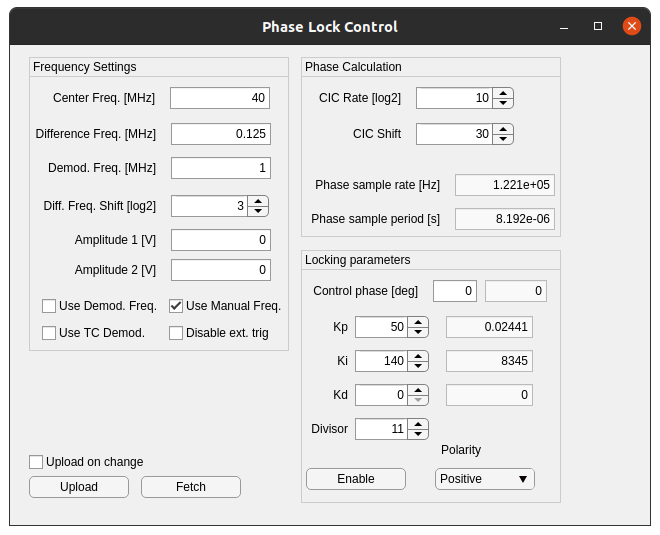

# Dynamic FPGA laser phase lock

## Introduction

Atom interferometers use two-photon transitions driven by a pair of laser beams at different frequencies to transfer atoms from one momentum state to another.  At the end of the interferometer, the population in each of the two momentum states is controlled by the interferometer phase which itself is determined by the relative phase of the two lasers.  Ideally, the only change in this relative phase seen by the atoms arises from changes to the atoms internal or external states and not from direct changes to the laser phases.  In reality, the stability of the laser phsaes is important for high precision atom interferometry.  While passive methods for stabilising this phase work well, achieving the lowest phase noise also requires active locking.

This project integrates a timing controller suitable for shaping Bragg or Raman laser pulses for atom interferometry with a phase measurement and locking system to stabilise the relative phase between the two lasers.  The project uses the Red Pitaya STEMlab or SIGNALlab FPGA system-on-a-chip (FPGA SoC) products, and design or software files, where different, are differentiated by either a 125 (STEMlab) or 250 (SIGNALlab) suffix.

## Overview


The diagram above gives a schematic overview of the physical and data connections.  The SoC consists of a CPU and an FPGA that can interface using direct memory access (DMA).  The CPU, running a Python socket server, acts as an intermediary between a remote computer controlled by the user and the hardware-level logic on the FPGA.  The remote computer sends data to and receives data from the SoC using a TCP/IP connection.  

Starting on the right-hand side of the diagram, the FPGA generates two sinusoidal signals on the digital-to-analog convertor (DAC) which are connected to two output ports OUT1 and OUT2.  The center frequency and frequency difference between these two outputs, as well as their amplitude and phase, is controlled by the "DualChannelDDS" module in the FPGA logic.  These are then put through an RF black box (RF Magic) to convert them into signals appropriate for driving acousto-optic modulators (AOMs).  As the output bandwidth of both the STEMlab and SIGNALlab boards is about 50 MHz, and we use 110 MHz center-frequency AOMs, we need to convert the output frequency of the board to somewhere near 110 MHz.  One option would be to use a x3 or x4 frequency multiplier to scale the output frequencies to near 110 MHz and then use amplifiers to get to the right amplitude.  Another option would be to mix the output frequencies with a common local oscillator near 80 MHz and then filter the resulting signal before amplification.

The method we use for generating the two frequencies for Bragg transitions is to start with a single laser, split it into two paths, pass the separate laser beams through their own AOMs (possibly double-pass AOMs), and then recombine the two frequencies on a final beam splitter.  One output port of the beam splitter goes to the atoms, while in order to phase lock the lasers we would send the other port to impinge on a photodiode.  The signal from the photodiode should then be routed to the input IN1, and it should display an interference signal at the frequency difference of the two laser beams.  It may be necessary to AC-couple the signal from the photodiode prior to connecting it to IN1; in the case of the SIGNALlab, there is a software-settable switch for changing the input coupling.

Within the FPGA architecture, the ADC signal IN1 is used by the "PhaseCalculation" module to compute the phase of the interference signal.  As the interference signal is neither at the OUT1 frequency or the OUT2 frequency, but rather their difference, the computed phase is relative to an arbitrary phase offset.  The SIGNALlab design records both the IN1 and IN2 signals using the "SaveADCData" module for debugging purposes.  The calculated phase is then passed to the "PhaseControl" module which implements a PID algorithm to drive the measured phase to a supplied control phase.  Whatever measured phase is present when the PID process starts is considered to be 0 for the purposes of the PID algorithm, and this phase is unwrapped across $2\pi$ to ensure continuous phase control; this unwrapped phase may be referred to as the unwrapped, re-summed phase in other documentation.  The unwrapped phase, the applied control phase, and the measured phase are all stored in FIFOs for later retrieval by the user.  The control phase is passed to the DualChannelDDS module and is used to change the phase offset word of the DDS driving OUT1.  As only the relative phase matters, only OUT1 has a controllable phase.  

Both the PhaseControl and the DualChannelDDS modules can be either controlled "statically" using simple digital registers to change various parameters, or they can be controlled dynamically using the "TimingController" module.  The static mode should only be used for testing purposes, as the dynamic mode is necessary for using the device with an atom gravimeter since the frequency difference between the lasers must be "chirped" to compensate for the gravity-induced Doppler shift and the pulses have to be shaped into either square pulses (for Raman), Gaussian pulses (for standard Bragg), or more complex shapes for more complex tasks.  The timing controller accepts a series of instructions from the user which comprise a frequency, phase, a pair of DDS amplitude scale factors, and the *duration* of the instruction.  On receipt of a start signal, either via software from the user or through an external trigger, the timing controller starts executing instructions by reading the current instruction and then waiting for the programmed delay before executing the next instruction.  The timing controller also outputs flags which govern the PID process, and there are currently two flags: one for enabling/disabling the PID and one for holding the PID at the current output.  

## Set up

### Creating the Vivado project

Follow these steps if you want to change the FPGA files or run simulations of the FPGA logic.

To create the Vivado project, clone the repository to a directory on your computer, open Vivado (this was made in Vivado 2020.2), and navigate to the fpga/ directory using the TCL console (use `pwd` to determine your current directory and `cd` to navigate).  Depending on which board you are working with, run either the command `source phase-lock-125.tcl` (for the STEMlab board) or `source phase-lock-250.tcl` (for the SIGNALlab board) which will create the project file under either the `phase-lock-125` or `phase-lock-250` directory.  This should create a project with no errors.  It may not correctly assign the AXI addresses, so you will need to open the address editor and assign the `PS7/AXI_Parse_0/s_axi` interface the address range `0x4000_0000` to `0x7fff_ffff`.  You should be able to synthesize, implement the design, and generate a bitstream with no errors.  

If you generate a new bitstream it will be under the {$project name}/{$project name}.runs/impl_1/system_wrapper.bit.  Copy the file into the main directory with an appropriate name.

### Starting the STEMlab or SIGNALlab board

Connect the device to power using either a > 2A USB power supply or the supplied power adapter (for the SIGNALlab) and the connection on the back of the box, and then connect the device to the local network using an ethernet cable.  Log into the device using SSH with the username `root` and the password `root` using the hostname `rp-{MAC}.local` where `{MAC}` is the the last 6 characters in the device's MAC address - this is printed on a sticker attached to the back of the device.

### First use

From the `software` directory, copy all Python, C, and bash files (*.py, *.c, *.sh), as well as the `Makefile`, to a directory on the device.  You will also need to copy the appropriate bitstream `phase-lock-125.bit` or `phase-lock-250.bit` from the fpga/ directory to the device.  You will need to compile the C programs before first use.  You can use the command
```
scp fpga/system_wrapper.bit software/*.py software/get_ip.sh software/*.c root@rp-{MAC}.local:/root/
```
to copy the software files, and then move then to a different directory as needed.

STEMlab: Only two C programs need to be compiled for the STEMlab board: `saveData.c` and `writeFile.c`.  You can compile these individually using `gcc -o saveData saveData.c` for `saveData.c` and similarly for `writeFile.c`.

SIGNALlab: Several files need to be compiled, and they have to be linked to the existing programs on the board.  Use the Makefile by calling `make` on the command line.  This should compile all the programs.  *I believe this is correct, but it has been long enough that I can't remember*

Next, change the execution privileges of `get_ip.sh` using `chmod a+x get_ip.sh`.  Check that running `./get_ip.sh` produces a single IP address (you may need to install dos2unix using `apt install dos2unix` and then run `dos2unix get_ip.sh` to make it work).  If it doesn't, run the command `ip addr` and look for an IP address that isn't `127.0.0.1` (which is the local loopback address).  There may be more than one IP address -- you're looking for one that has tags 'global' and 'dynamic'.  Here is the output from one such device:
```
root@rp-f0919a:~# ip addr
1: lo: <LOOPBACK,UP,LOWER_UP> mtu 65536 qdisc noqueue state UNKNOWN group default qlen 1
    link/loopback 00:00:00:00:00:00 brd 00:00:00:00:00:00
    inet 127.0.0.1/8 scope host lo
       valid_lft forever preferred_lft forever
    inet6 ::1/128 scope host 
       valid_lft forever preferred_lft forever
2: eth0: <BROADCAST,MULTICAST,UP,LOWER_UP> mtu 1500 qdisc pfifo_fast state UP group default qlen 1000
    link/ether 00:26:32:f0:91:9a brd ff:ff:ff:ff:ff:ff
    inet 169.254.176.82/16 brd 169.254.255.255 scope link eth0
       valid_lft forever preferred_lft forever
    inet 192.168.1.109/24 brd 192.168.1.255 scope global dynamic eth0
       valid_lft 77723sec preferred_lft 77723sec
3: sit0@NONE: <NOARP> mtu 1480 qdisc noop state DOWN group default qlen 1
    link/sit 0.0.0.0 brd 0.0.0.0
```
In this case the one we want is the address `192.168.1.109`.  `get_ip.sh` should work as it looks for IP addresses that have the tag "dynamic".

### After a reboot or power-on

You will need to re-configure the FPGA and start the Python socket server after a reboot.  To re-configure the FPGA run the command
```
cat phase-lock-125.bit > /dev/xdevcfg
```
for the STEMlab design.  

There are some issues with the SIGNALlab design where it doesn't work without loading the manufacturer's design first.  To do this, open a web browser and navigate to http://rp-{MAC}.local/.  This should open their browser-based GUI and load their design.  Once this has loaded, you can close the browser/tab and then load your own design
```
cat phase-lock-250.bit > /dev/xdevcfg
```

To start the Python socket server run
```
python3 appserver.py &
```
This should print a line telling you the job number and process ID  as, for example, `[1] 5760`, and a line telling you that it is 'Listening on' and then an address and port number.  The program will not block the command line and will run in the background as long as the SSH session is active (The ampersand & at the end tells the shell to run the program in the background).  To stop the server, run the command `fg 1` where `1` is the job number and then hit 'CTRL-C' to send a keyboard interrupt.

If you want to start the server and have it run without it stopping when the terminal window is closed, use the command
```
nohup python3 /root/server/appserver.py & disown
```

### After starting/restarting the SSH session

You will need to check that the socket server is running.  Run the command
```
ps -ef | grep appserver.py
```
This will print out a list of processes that match the pattern `appserver.py`.  One of these might be the `grep` process itself -- not especially useful -- but one might be the socket server.  Here's an example output:
```
root      5768  5738  7 00:59 pts/0    00:00:00 python3 appserver.py
root      5775  5738  0 01:00 pts/0    00:00:00 grep --color=auto appserver.py
```
The first entry is the actual socket server process and the second one is the `grep` process.  If you need to stop the server, and it is not in the jobs list (run using `jobs`), then you can kill the process using `kill -15 5768` where `5768` is the process ID of the process (the first number in the entry above).  

If you want the server to run you don't need to do anything.  If the server is not running, start it using `python3 appserver.py`.  

## Use

Control of the phase lock is expected to be done through MATLAB, as that is the language in which most of our control systems have been written.  The main class is `PhaseLockAbstract` which is an abstract class with sub-classes `PhaseLock125` and `PhaseLock250` which are concrete classes.  In addition to the `IOSettings` class for the SIGNALlab device, these classes have properties and methods allowing for control of the phase lock and timing controller.

**You will need** to have the `red-pitaya-interface` repository somewhere in your MATLAB path, and it can be cloned from `https://github.com/atomlaser-lab/red-pitaya-interface/`.

Most properties that correspond to a parameter in the FPGA are instances of the `DeviceParameter` class found in the `red-pitaya-interface` repository.  This class handles limits on the parameters and conversions between real, human-understandable values and the integer values understood by the FPGA.  These definitions are given in the `PhaseLockAbstract` constructor method.  The parameters defined in the abstract class are:

  - `shift`: The scaling factor between the frequency difference between the on-board DDSs and the actual frequency measured by IN1 expressed as a bit-shift to the left.  In at least one embodiment, the RF signals from OUT1 and OUT2 are doubled, and the lasers pass through double-pass AOMs, and then the beat note is the frequency difference between the two laser frequencies, so the scaling factor is $2^3 = 8$, corresponding to a bit shift to the left of 3.
  - `useSetDemod`: Set to 1 (true) to use a fixed demodulation frequency rather than the shifted frequency difference.  This is useful for testing.  Set to 0 (false) otherwise.
  - `useManual`: Use manually supplied frequency differences, demodulation frequencies, phases, and amplitudes.  Used for testing.
  - `useTCDemod`: Interpret the timing controller (TC) `df` output as a demodulation frequency and the OUT1 frequency. Used for testing.
  - `disableExtTrig`: Set to 1 (true) to disable the external trigger.
  - `f0`: The center frequency of the DDS outputs in MHz.
  - `df`: The manually-set frequency difference between the DDS channels.  OUT1 is set to $f_0 + df$ and OUT2 to $f_0 - df$.
  - `demod`: The manually-set demodulation frequency to use for phase estimation.  Only valid when both `useManual` and `useSetDemod` are true.
  - `amp`: The manually-set scaling factors for the DDS amplitudes.  This is a 2-element array, and values are between 0 and 1.
  - `cicRate`: Log base 2 of the CIC rate reduction.  The CIC filter downsamples from the main sampling frequency (either 125 MSPS or 250 MSPS), and it downsamples by CLK/2^cicRate.  
  - `cicShift`: Number of bits to shift right by after the CIC filter.  The CIC filter tends to scale up the values, so shift right to reduce the output of the CIC filter to something just within the bit range of subsequent calculation stages.
  -`phasec`: The manually-set control phase.  Used for testing.
  - `enableFB`: The enable value for the PID controller.  When the timing controller is disabled, this value is used.
  - `polariy`: The PID polarity, either 0 (negative) or 1 (positive).
  - `Kp`, `Ki`, `Kd`: The proportional, integral, and derivative gains, respectively.
  - `divisor`: The number of bits to shift right by after multiplication by the PID gains.  This allows for an approximate multiplication by a rational number.  The actual gains are Kp/2^divisor and so on.

There are additional parameters `t` and `data` which store data retrieved from the FPGA.  The parameters above, which are of the class `DeviceParameter`, can have their values set using the `set()` method and values retrieved using the `get()` method.  The real value and the integer value can be retrieved using the `value` and `intValue` properties.

The `PhaseLock250` class has the following additional properties:
  - `settings`: An `IOSettings` object which stores the software-settable I/O settings for the SIGNALlab, which are the ADC attenuation mode, the ADC input coupling type, and the DAC gain mode.
  - `numSamples`: The number of samples to record from the two channels of the ADC.  Used for debugging purposes.
  - `lastSample`: The last memory address used when recording ADC data.  Read-only.  Used for debugging.
  - `adc`: The last ADC value stored in memory.  Used for debugging.

The abstract class also defines the following methods:
  - `setDefaults()`: Sets default values for the object.
  - `upload()`: Uploads all registers to the FPGA.
  - `fetch()`: Retrieves all registers from the FPGA.
  - `readOnly()`: Returns debugging information in the form of a data structure.
  - `start()`: Triggers the timing controller
  - `resetTC()`: Resets the timing controller so that new instructions are not appended to old ones.
  - `updateCIC()`: Updates the CIC downsampling rate.  Should be used whenever the CIC rate is changed.
  - `convertDAC(v,direction)`: Converts DAC value `v` to either volts (`direction` = `'volt'`) or to an integer value (`direction` = `'int'`).
  - `convertADC(v,direction)`: Converts ADC value `v` to either volts (`direction` = `'volt'`) or to an integer value (`direction` = `'int'`).
  - `dt()`: Returns the time step corresponding to the CIC downsampled rate.
  - `[Kp,Ki,Kd] = calcRealGains()`: Returns continuous-equivalent PID proportional, integral, and derivative gains `Kp`, `Ki`, and `Kd`.

There are two important methods used for retrieving phase data and uploading timing data.  Phase data can be retrieved from the device using `getPhaseData(...)`, and the MATLAB documentation is:
```
%GETPHASEDATA Retrieves recorded phase data from the phase lock
    %
    %   Phase data is stored in the DATA property of the class, and
    %   timing information in the T property.
    %
    %   SELF.GETPHASEDATA(NUMSAMPLES) Returns NUMSAMPLES samples of
    %   only the directly measured phase.  The timing controller is
    %   not triggered prior to retrieving data.
    %
    %   SELF.GETPHASEDATA(__,SAVEFLAGS) gets phase data according
    %   the save flags, which are formatted as standard GNU flags.
    %   Use -p for the directly measured phase, -s for the
    %   phase-unwrapped re-summed phase, and -d for the phase that
    %   is applied to the DDS.  These can be combined as -psd or
    %   -ps or any such combination.
    %
    %   SELF.GETPHASEDATA(__,STARTFLAG) Set to 1 to trigger the
    %   timing controller prior to phase acquisition.  Set to 0 to
    %   not trigger.
    %
    %   SELF.GETPHASEDATA(__,SAVETYPE) Method for saving data in
    %   the C program running on the device.  Set to 0 to print
    %   data to terminal. Set to 1 to save to RAM before writing to
    %   a file and then sending over TCP/IP, and set to 2 to save
    %   directly to a file before sending over TCP/IP.  Default is
    %   1, and this likely never needs to change.
    %
```

The documentation for `uploadTiming` is:
```
%UPLOADTIMING Uploads timing controller data to the FPGA
    %
    %   SELF.UPLOADTIMING(T,PH,AMP,FREQ) Uploads timing data given
    %   by times T (in seconds), phase PH in radians, DDS scale
    %   factors AMP as an numel(T) x 2 array of values between 0
    %   and 1, and frequency FREQ as the frequency difference
    %   between the two DDS in MHz.
    %
    %   SELF.UPLOADTIMING(__,FLAGS) Additionally uploads flags
    %   FLAGS to the device.  FLAGS is a 4 bit signal in the timing
    %   controller.  Bit 0 of FLAGS enables the PID controller when
    %   high and disables when low.  Bit 1 of FLAGS holds the
    %   PID controller when high and resumes the PID controller
    %   when low.
    %
```

### Examples

Below is an example of how to initialize the object, set properties, and retrieve phase data:
```
pl = PhaseLock125();    %Create object
pl.setDefaults();       %Set defaults

pl.shift.set(3);        %Shift the programmed df 3 bits to the left, multiplying by 8
pl.f0.set(30);          %30 MHz center frequency
pl.amp(1).set(1);       %Set amplitude of OUT1 to maximum
pl.amp(2).set(1);       %Set amplitude of OUT2 to maximum

pl.cicRate.set(10);     %Set decimation rate to be 2^10 = 1024, so new phase information is available at 125/1024 MHz
pl.cicShift.set(30);    %Shift filtered values 30 bits to the right.  The CIC filter scales by 2^(3*cicRate), so this just cancels out the shift

pl.enableFB.set(1);     %Enable feedback
pl.polarity.set(1);     %Set polarity to positive
pl.Kp.set(50);
pl.Ki.set(140);
pl.Kd.set(0);
pl.divisor.set(11);     %Shift all PID gain values 11 bits to the right

%% Upload data
pl.upload();

%% Retrieve phase data
pl.getPhaseData(10e3,'-psd','');

figure(1);clf;
plot(pl.t,pl.data.ph,'.-');
xlabel('Time [s]');ylabel('Measured phase [rad]');
```

For uploading timing sequences, see the function `makeBraggSequence_pl`.

### GUI

A MATLAB GUI exists to make testing easier with manual control.  To use it, first create a phase lock object, and then run the GUI using
```
pl = PhaseLock125;  %Create object
App_PhaseLock(pl);  %Start GUI
```
A screenshot of the GUI is below:


