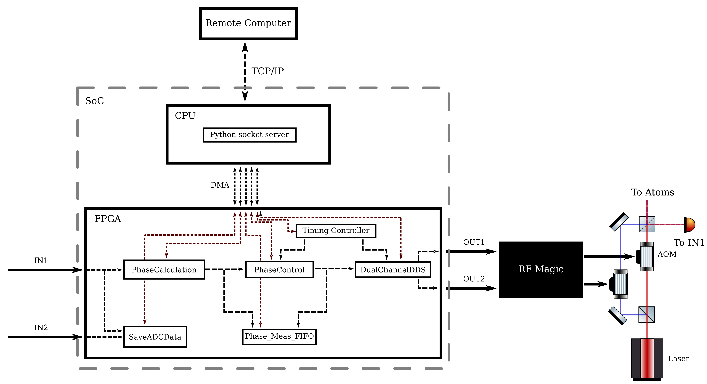

# Dynamic FPGA laser phase lock

## Introduction

Atom interferometers use two-photon transitions driven by a pair of laser beams at different frequencies to transfer atoms from one momentum state to another.  At the end of the interferometer, the population in each of the two momentum states is controlled by the interferometer phase which itself is determined by the relative phase of the two lasers.  Ideally, the only change in this relative phase seen by the atoms arises from changes to the atoms internal or external states and not from direct changes to the laser phases.  In reality, the stability of the laser phsaes is important for high precision atom interferometry.  While passive methods for stabilising this phase work well, achieving the lowest phase noise also requires active locking.

This project integrates a timing controller suitable for shaping Bragg or Raman laser pulses for atom interferometry with a phase measurement and locking system to stabilise the relative phase between the two lasers.  The project uses the Red Pitaya STEMlab or SIGNALlab FPGA system-on-a-chip (FPGA SoC) products; the current branch uses the SIGNALlab device which has a 250 MSPS input data rate.  **This project is still under development**.  

## Overview

The diagram above gives a schematic overview of the physical and data connections.  The SoC consists of a CPU and an FPGA that can interface using direct memory access (DMA).  The CPU, running a Python socket server, acts as an intermediary between a remote computer controlled by the user and the hardware-level logic on the FPGA.  The remote computer sends data to and receives data from the SoC using a TCP/IP connection.  

Starting on the right-hand side of the diagram, the FPGA generates two sinusoidal signals on the digital-to-analog convertor (DAC) which are connected to two output ports OUT1 and OUT2.  The center frequency and frequency difference between these two outputs, as well as their amplitude and phase, is controlled by the "DualChannelDDS" module.  These are then put through an RF black box (RF Magic) to convert them into signals appropriate for driving acousto-optic modulators (AOMs).  As the output bandwidth of both the STEMlab and SIGNALlab boards is about 50 MHz, and we use 110 MHz center-frequency AOMs, we need to convert the output frequency of the board to somewhere near 110 MHz.  One option would be to use a x3 or x4 frequency multiplier to scale the output frequencies to near 110 MHz and then use amplifiers to get to the right amplitude.  Another option would be to mix the output frequencies with a local oscillator near 80 MHz and then filter the resulting signal before amplification.

The method we use for generating the two frequencies for Bragg transitions is to start with a single laser, split it into two paths, pass the separate laser beams through their own AOMs (possibly double-pass AOMs), and then recombine the two frequencies on a final beam splitter.  One output port of the beam splitter goes to the atoms, while in order to phase lock the lasers we would send the other port to impinge on a photodiode.  The signal from the photodiode should then be routed to the input IN1, and it should display an interference signal at the frequency difference of the two laser beams.

Within the FPGA architecture, the ADC signal IN1 is used by the "PhaseCalculation" module to compute the phase of the interference signal.  As the interference signal is neither at the OUT1 frequency or the OUT2 frequency, but rather their difference, the computed phase is relative to an arbitrary phase offset.  The IN1 and IN2 signals are both recorded by the "SaveADCData" module for debugging purposes.  The calculated phase is then passed to the "PhaseControl" module which implements a PID algorithm to drive the measured phase to a supplied control phase.  Whatever measured phase is present when the PID process starts is considered to be 0 for the purposes of the PID algorithm, and this phase is unwrapped across $2\pi$ to ensure continuous phase control.  The unwrapped phase, the applied control phase, and the measured phase are all stored in FIFOs for later retrieval by the user.  The control phase is passed to the DualChannelDDS module and is used to change the phase offset word of the DDS driving OUT1.  As only the relative phase matters, only OUT1 has a controllable phase.  

Both the PhaseControl and the DualChannelDDS modules can be either controlled "statically" using simple digital registers to change various parameters, or they can be controlled dynamically using the "TimingController" module.  The static mode should only be used for testing purposes, as the dynamic mode is necessary for using the device with an atom gravimeter since the frequency difference between the lasers must be "chirped" to compensate for the gravity-induced Doppler shift and the pulses have to be shaped into either square pulses (for Raman), Gaussian pulses (for standard Bragg), or more complex shapes for more complex tasks.  The timing controller accepts a series of instructions from the user which comprise a frequency, phase, a pair of DDS amplitude scale factors, and the *duration* of the instruction.  On receipt of a start signal, either via software from the user or through an external trigger, the timing controller starts executing instructions by reading the current instruction and then waiting for the programmed delay before executing the next instruction.  

## Use

### Creating the project

To create the project, clone the repository to a directory on your computer, open Vivado (this was made in Vivado 2020.2), navigate to the fpga/ directory using the TCL console (use `pwd` to determine your current directory and `cd` to navigate), and then run the command `source phase-lock.tcl` which will create the project file under the `phase-lock` directory.  If you want a different name open the `phase-lock.tcl` file and edit the line under the comment `# Set the project name`. This should create a project with no errors.  It may not correctly assign the AXI addresses, so you will need to open the address editor and assign the `PS7/AXI_Parse_0/s_axi` interface the address range `0x4000_0000` to `0x7fff_ffff`.  You should be able to synthesize, implement the design, and generate a bitstream with no errors.

### Starting the SIGNALlab

Connect the SIGNALlab box to power using the supplied power adapter and the connection on the back of the box, and then connect the device to the local network using an ethernet cable.  Log into the device using SSH with the username `root` and the password `root` using the hostname `rp-{MAC}.local` where `{MAC}` is the the last 6 characters in the device's MAC address - this is printed on a sticker attached to the back of the device.

#### First use

From the `software` directory, copy all Python, C, and bash files (*.py, *.c, *.sh), as well as the `Makefile`, to a directory on the SIGNALlab.  You will also need to copy the `phase-lock.bit` file from the fpga/ directory to the SIGNALlab.